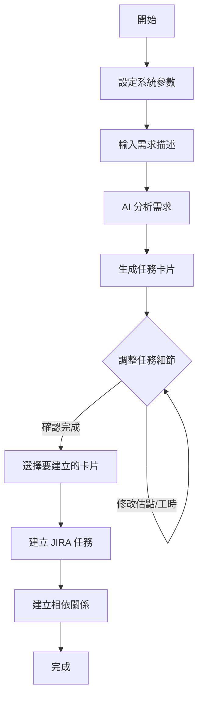
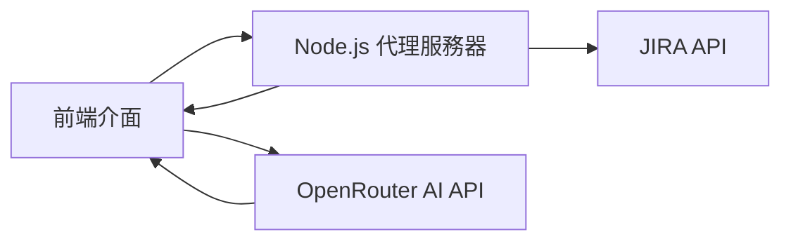
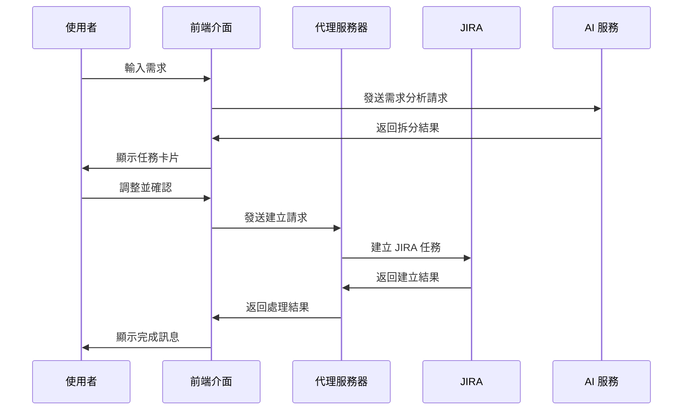

# JIRA AI 需求拆分工具

這是一個結合 AI 技術的 JIRA 需求拆分工具，可以幫助團隊更有效率地進行需求分析和任務拆分。

## 功能特點

- 🤖 使用 AI 智能分析需求
- 📋 自動拆分為適當大小的任務卡片
- 🔄 支援故事點數和工時估算調整
- 🔗 自動建立任務相依關係
- 🌐 多語言支援（i18n）
- 🔌 整合 JIRA API

## 系統需求

- Node.js 14.0 或以上版本
- 現代化瀏覽器（Chrome、Firefox、Edge 等）
- JIRA 帳號和 API 權限
- OpenRouter API 金鑰

## 安裝步驟

1. 克隆專案：
   ```bash
   git clone [專案網址]
   cd aicutation2jira
   ```

2. 安裝依賴：
   ```bash
   npm install
   ```

3. 設定環境變數：
   - 複製 `.env.example` 為 `.env`
   - 填入必要的設定值

4. 啟動代理服務器：
   ```bash
   npm run dev
   ```

5. 開啟應用程式：
   - 使用瀏覽器開啟 `index.html`

## 使用流程



## 系統架構



## 資料流程



## 主要功能說明

### 1. 需求分析
- 使用 AI 模型分析需求文本
- 識別關鍵功能點
- 建議合適的拆分方式

### 2. 任務拆分
- 自動生成任務標題和描述
- 建議故事點數和工時
- 識別任務相依關係
- 支援多種任務類型（前端、後端、設計等）

### 3. 估算調整
- 可調整故事點數（1、2、3、5、8、13）
- 可調整預估工時（支援小數點）
- 即時更新調整結果

### 4. JIRA 整合
- 自動建立 JIRA 任務
- 設定任務相依關係
- 支援添加到 Sprint
- 可指定預設經辦人

## 注意事項

1. 安全性考慮
   - 請勿在公共環境儲存敏感資訊
   - 定期更新 API 金鑰
   - 使用適當的權限設定

2. 使用建議
   - 定期備份重要資料
   - 在建立大量任務前先確認設定
   - 注意 API 使用限制

## 常見問題

Q: 為什麼需要代理服務器？
A: 為了解決瀏覽器的 CORS 限制，確保能安全地與 JIRA API 通訊。

Q: 如何調整 AI 生成的結果？
A: 您可以直接在介面上調整故事點數和工時，系統會即時儲存修改。

Q: 支援哪些 JIRA 項目類型？
A: 目前支援 Story、Task、Bug 等標準類型，可根據需求擴充。

## 更新日誌

### v1.0.0
- 初始版本發布
- 基本需求拆分功能
- JIRA 整合
- AI 分析支援

## 貢獻指南

歡迎提交 Issue 和 Pull Request 來改善此工具。

## 授權

MIT License
